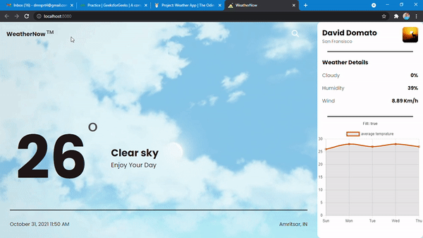

# WeatherNow 💯
    
## This web app lets you know weather of the city you enter.

## Live 🌞

[](https://data-pirate.github.io/what-is-the-weather-now/)



## Usage 🔧

- Go to site and search for the city name.
- The api will fetch the results and show them.
## Built With 🧰

- [JavaScript](https://www.javascript.com/)
- [Webpack](https://www.webpack.js.org)

## Features 💿
- dynamically change the background according to the weather condition
- dynamically shows the tips according to the weather
- plots the next day weather on the chart
- shows details of the current day
    
## Running Locally 🖥️

1. Clone the repo or your fork.
1. Install required dependencies
    ```js
    npm install
    ```
1. Run the App 
    ```js
    npm start
    ```

## Contributors ✨

- Damanpreet singh - [@data-pirate](https://github.com/data-pirate) <dmnprt4@gmail.com>

## Contributing 🤝

### Feature Suggestion and Problems 💎

Go to [Issues](https://github.com/data-pirate/what-is-the-weather-now/issues) on the repo.

- Create an explaining the Feature.
- If you find any errors/issues, feel free to create an Issue.

### Pull Requests 🔀

How to make code changes and add them to this repo with a Pull Request.

1. Fork the Project
1. Clone it using the URL from the Code button.
    ```sh
    git clone FORK_URL
    ```
1. Create your Feature Branch
    ```sh
    git checkout -b feat-my-feature
    ```
1. Commit your Changes
    ```sh
    git commit -m 'Add some Amazing Feature'
    ```
1. Push to the Branch
    ```sh
    git push origin feat-my-feature
    ```
1. Go to of the original repo.
1. Create a Pull Request. Compare across forks and pick your fork and your branch.

Once your PR is merged, I will add you as a contributor :)

Or if you wish to add yourself to 'Users who used this app' list, simply fork the repo, update the README and make a PR. Follow this format:

```markdown
- <a href = 'https://github.com/USERNAME'> DISPLAY NAME </a>
```

Or just reach out to me on Twitter/LinkedIn and I'll add you :)

To keep your fork's main branch up to date with that of the original repo, then on your fork on GitHub click the Fetch Upstream button near the top.

## Plans for future release 📆

- Adding more badges
- showing the weather for current location without asking to user
- Increasing number of social Icons


## License ⚖️

- Distributed under the `MIT License